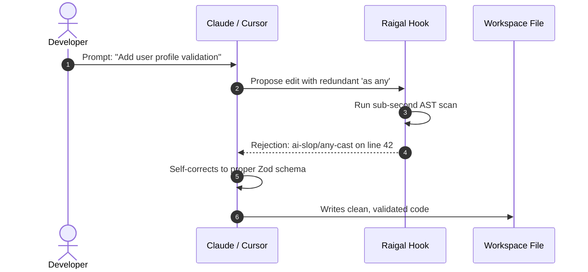

# Agent Real-Time Hooks

One of Raigal's most powerful capabilities is real-time interception: intercepting AI coding agent edits **before** they land on your disk.

## How Hooks Work

When an AI coding agent attempts to modify a source file:
1. The hook triggers a sub-second localized scan on the staged/modified buffer.
2. If the agent introduces slop (e.g. redundant null checks, fake helper methods, or stripped error handling), the hook rejects or warns the agent immediately.
3. The agent receives the exact diagnostic feedback in its internal reasoning loop and automatically corrects the mistake.



## Installing Hooks

Install hooks for all detected agents on your system:

```bash
raigal hook install
```

Or target specific tools:

```bash
raigal hook install claude cursor opencode
```

## Status & Baselines

Check active hooks:

```bash
raigal hook status
```

Capture the current codebase score as your baseline:

```bash
raigal hook baseline
```
The hook will ensure that no future AI edits decrease your baseline score.
