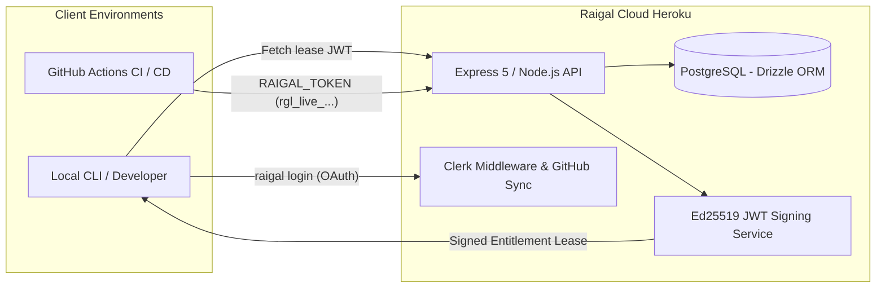

# Raigal Cloud Architecture

Raigal Cloud is the central management control plane for organization accounts, team memberships, and offline license leases.

## High-Level Topology

## Core Infrastructure Components

### 1. Web Application & API
- **Framework**: Express 5 on Node.js 22.
- **Frontend Dashboard**: React 19 + Vite + Tailwind CSS + Lucide icons.
- **Hosted on**: Heroku dyno runtime (`web` process).

### 2. Authentication & Identity
- **Provider**: Clerk (`@clerk/express` & `@clerk/clerk-react`).
- **Organization Roles**: Automatic sync with GitHub accounts and Clerk organization memberships.

### 3. Database Layer
- **Engine**: Heroku PostgreSQL.
- **ORM**: Drizzle ORM with schema migrations managed via `drizzle-kit`.
- **Tables**: `organizations`, `users`, `memberships`, `api_keys`, `leases`, `telemetry_events`.

### 4. Admin Route Protection
Platform routes under `/api/admin/*` are strictly guarded by `PLATFORM_ADMIN_USER_IDS` in the environment. Non-admin callers receive an indistinguishable 404 response.
