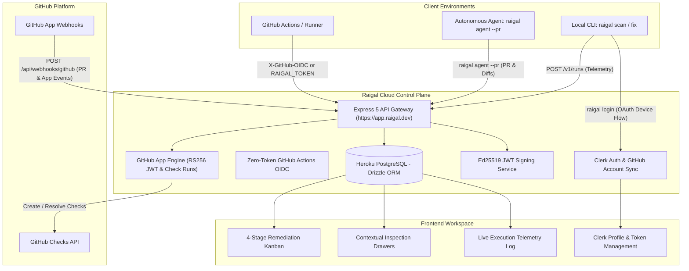

# Raigal Cloud Architecture

Raigal Cloud is the centralized quality control plane for managing organizations, analyzing CI/CD quality gates, tracking autonomous coding agent PRs, enforcing GitHub App branch protection checks, and issuing offline cryptographic entitlement leases.

## High-Level Topology

## Core Infrastructure Components

### 1. Web Application & API Gateway
- **Backend Framework:** Express 5 running on Node.js 22 LTS.
- **Frontend Dashboard:** React 19 + TypeScript + Vite + Tailwind CSS + Lucide icons.
- **Runtime:** Heroku dyno ecosystem with automatic HTTPS at `https://app.raigal.dev`.

### 2. Identity, Authentication & Permissions
- **Identity Provider:** Clerk (`@clerk/express` and `@clerk/clerk-react`) with multi-tenant organization switching.
- **GitHub Automatic Sync:** Automatically queries and maps verified GitHub accounts and organization owners into the platform's allowlist.
- **OAuth Device Authorization:** Enables terminal authentication (`raigal login` / `npx @methiu/raigal login`) using RFC 8628 OAuth device flow to bind local developer machines to cloud organizations.
- **Zero-Token GitHub Actions OIDC:** Exchanges GitHub runner OIDC tokens (`X-GitHub-OIDC`) for ephemeral entitlements, eliminating long-lived static secrets in CI.

### 3. Hybrid GitHub App Engine
- **Webhook Processing:** Cryptographically validates HMAC-SHA256 signatures via raw body capture.
- **Lifecycle Events:** Listens to `installation`, `installation_repositories`, and `pull_request` (opened, synchronize, closed, reopened).
- **Check Run Management:** Mints RS256 App JWTs via `jose`, exchanges them for installation tokens, and manages native `"Raigal Quality Gate"` checks correlated by commit `head_sha`.
- **Fail-Open Check Resolution:** Ingestion of CI runs in `POST /v1/runs` resolves check runs asynchronously; GitHub API latency or rate limits never block run ingestion.
- **Orphan Sweeper:** Automatically sweeps pending check runs older than 20 minutes and marks them `timed_out`.

### 4. Database Layer & Schema
- **Database Engine:** Heroku PostgreSQL.
- **ORM & Migrations:** Drizzle ORM and `drizzle-kit`.
- **Core Entities:**
  - `organizations`: Account profiles, subscription status, and trial clocks.
  - `allowed_owners`: Allowlist of GitHub organizations and personal accounts authorized to ingest telemetry.
  - `pull_requests`: Persistent tracking of CI pull request gates and agent remediations. Unique constraint on `(org_id, repo_id, pr_number)` with guarded in-place updates.
  - `github_installations`: Installed GitHub App installations mapped to authorized organizations.
  - `github_check_runs`: Active and resolved checks indexed by `head_sha` and `(status, created_at)`.
  - `runs`: Ingested CLI scans, exit codes, overall scores, and timing metrics.
  - `findings`: Granular diagnostic violations scoped to runs, rule IDs, and source lines.
  - `api_keys`: SHA-256 hashed secret tokens (`rgl_live_...`).

### 5. Zero-Mock Data Guarantee
Every view and metric on the Raigal Cloud board reflects real ingested telemetry:
- Scan findings, quality scores, and PR gates are pulled directly from live database tables.
- Out-of-order webhook delivery is prevented using timestamp-guarded SQL updates (`WHERE excluded.started_at >= pull_requests.started_at`).
- No fabricated default scores or artificial durations are injected into the pipeline.
