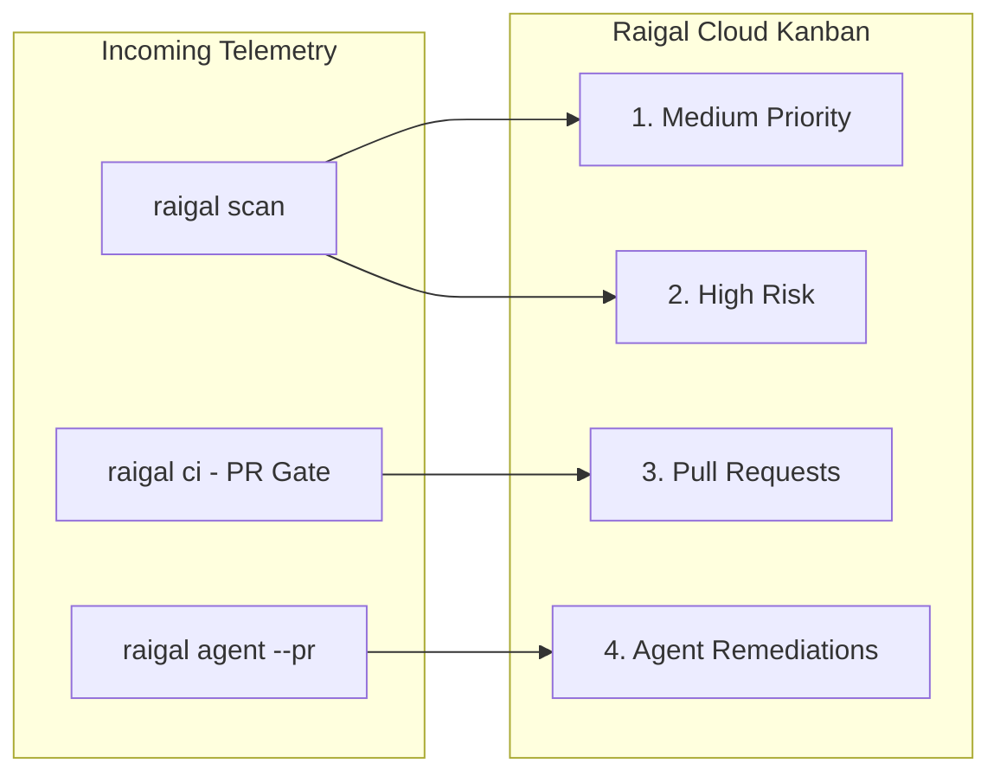

# Remediation Kanban & Telemetry

Raigal Cloud provides a real-time, density-aware Kanban board that translates raw code-quality findings into prioritized developer workflows.

## The 4-Stage Kanban Board

The Remediation Board organizes your repository's findings across four specialized columns:

### 1. Medium Priority
- **Focus:** Non-blocking warnings, style issues, minor dead code, and low-severity AI slop patterns (trivial comments, redundant null checks).
- **Actions:** Quick 1-click copy of the deterministic autofix command (`npx @methiu/raigal fix --rule <rule-id>`).
- **Inspection:** Clicking any card opens the slide-over inspection drawer with full code snippets and line numbers.

### 2. High Risk
- **Focus:** Critical blockers that fail CI gates, exposed API secrets, SQL/command injections, unsafe typecasts (`as any`), and empty exception handlers (`silent-catch`).
- **Actions:** Highlighted critical badges with deterministic remediation guidance.

### 3. Pull Requests (CI Gates)
- **Focus:** Active Pull Requests evaluated by the Raigal Quality Gate in GitHub Actions or GitHub App webhooks.
- **Status Badges:**
  - `PASSED [score]`: PR meets or exceeds the configured quality threshold (score renders when evaluated).
  - `BLOCKED [score]`: PR contains blocking violations or falls below the minimum score.
  - `IN REVIEW / PENDING`: PR is open and waiting for CI evaluation (instantly created by the GitHub App).
  - `MERGED`: PR has been merged into the base branch (automatically updated via GitHub App webhook).
  - `CLOSED`: PR was closed without merging.
- **Idempotency & Isolation:** Sequential pushes on the same PR update the card in-place. Out-of-order webhook delivery is guarded so newer telemetry is never overwritten by stale runs. Standard PRs and autonomous agent remediations are cleanly segregated.

### 4. Agent Remediations (`--pr`)
- **Focus:** Pull requests autonomously generated by AI coding agents (`raigal agent --provider <opencode|claude|codex> --pr`).
- **Telemetry:**
  - **Provider Badge:** Identifies the authoring agent (`opencode`, `claude`, `codex`, or custom orchestrators).
  - **Score Improvement:** Displays measured before/after score deltas (e.g., `72 → 88 (+16 pts)`).
  - **Patch Diff:** Shows exact unified diffs generated and verified inside isolated git worktrees.

---

## Slide-Over Contextual Inspection Drawers

Every card on the board can be clicked to open a detailed slide-over panel:

<table data-view="cards">
  <thead>
    <tr>
      <th>Drawer</th>
      <th>Content</th>
      <th>Key Action</th>
    </tr>
  </thead>
  <tbody>
    <tr>
      <td><strong>Vulnerability Drawer</strong></td>
      <td>Rule ID, engine, line number, file path, and rule explanation.</td>
      <td><code>Copy CLI Fix</code> — Copies exact fix command to clipboard.</td>
    </tr>
    <tr>
      <td><strong>Pull Request Drawer</strong></td>
      <td>Branch name, author, score, CI gate logs, and blocking findings.</td>
      <td><code>Copy git checkout</code> — Copies branch checkout command.</td>
    </tr>
    <tr>
      <td><strong>Agent Details Drawer</strong></td>
      <td>Agent provider, before/after score comparison, and patch diff.</td>
      <td><code>Copy gh merge</code> — Copies 1-click GitHub merge command.</td>
    </tr>
  </tbody>
</table>

---

## Branch Isolation & Zero State Leakage

To prevent finding duplication across feature branches:
- The board queries the **single latest completed run** on the active branch.
- Switching branches via the header dropdown instantly re-scopes all findings and metric cards without stale data carry-over.
- Deep-linked URLs preserve your exact workspace state: `/repos/:repoId?branch=feat/auth&drawer=vuln&id=...`.

---

## Navigation & Quick Actions (⌘K)

- **Top Navigation:** Sticky repository selector dropdown, active branch switcher, and quick view toggles.
- **Command Palette (`⌘ K`):** Instant search to copy CLI scan/fix commands, jump to documentation, filter by engine (AI Slop or Security), or trigger a manual GitHub repository sync.
- **Settings Dashboard:** Access your `RAIGAL_API_URL`, manage masked `RAIGAL_TOKEN` keys, manage allowed GitHub owners, and inspect repository runs.
