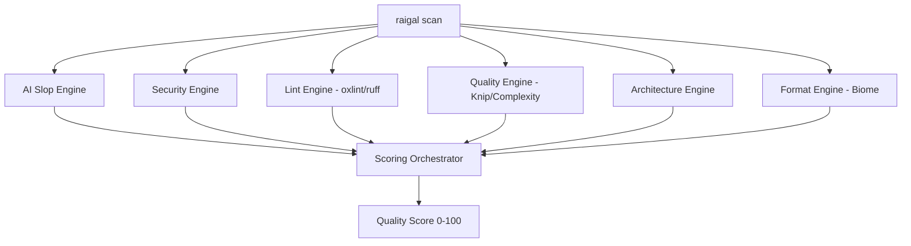

# Rules & Detection Engines

Raigal executes 6 specialized engines in parallel during every scan:



## AI Slop Rules Catalogue

| Rule ID | Severity | What it Detects | Auto-Fixable |
|---|---|---|---|
| `ai-slop/trivial-comment` | Warning | Comments that merely parrot function or variable names. | Yes |
| `ai-slop/defensive-null` | Warning | Useless defensive checks on values guaranteed not-null by types. | Yes |
| `ai-slop/fake-polyfill` | Error | Hallucinated helper methods replacing standard library functions. | No (Agent) |
| `ai-slop/silent-catch` | Error | Empty catch blocks swallowing errors without logging or rethrowing. | No (Agent) |
| `ai-slop/any-cast` | Warning | Unsafe `as any` type bypasses injected to silence the typechecker. | No (Agent) |
| `ai-slop/over-engineered-regex` | Warning | Overly complex regexes where simple string methods suffice. | No (Agent) |
| `ai-slop/duplicate-logic` | Warning | Copy-pasted helper functions across adjacent modules. | Yes |
| `ai-slop/unhandled-todo` | Info | Placeholder TODOs or hallucinated unimplemented stubs. | No |

## Overriding Rule Behaviors

In your `.raigal/rules.yml`, adjust severity or disable rules cleanly:

```yaml
rules:
  ai-slop/trivial-comment:
    severity: off
  ai-slop/any-cast:
    severity: error
    weight: 2.0
```
