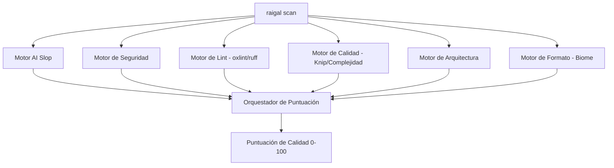

# Reglas y Motores de Detección

Raigal ejecuta 6 motores especializados en paralelo durante cada análisis:



## Catálogo de Reglas contra AI Slop

| Identificador | Severidad | Qué detecta | Autofix |
|---|---|---|---|
| `ai-slop/trivial-comment` | Warning | Comentarios que repiten literalmente lo que hace el código. | Sí |
| `ai-slop/defensive-null` | Warning | Comprobaciones de nulos innecesarias en tipos garantizados. | Sí |
| `ai-slop/fake-polyfill` | Error | Métodos auxiliares redundantes que reinventan la librería estándar. | No (Agente) |
| `ai-slop/silent-catch` | Error | Bloques `catch` vacíos que ocultan excepciones sin registrar. | No (Agente) |
| `ai-slop/any-cast` | Warning | Casts de tipo `as any` para silenciar el verificador estático. | No (Agente) |
| `ai-slop/over-engineered-regex` | Warning | Expresiones regulares sobre-complejas para tareas simples de texto. | No (Agente) |
| `ai-slop/duplicate-logic` | Warning | Funciones duplicadas por copiar y pegar entre módulos contiguos. | Sí |
| `ai-slop/unhandled-todo` | Info | Comentarios TODO o stubs sin implementar creados por IA. | No |

## Personalización de Reglas

En su archivo `.raigal/rules.yml` puede ajustar el comportamiento de cada regla:

```yaml
rules:
  ai-slop/trivial-comment:
    severity: off
  ai-slop/any-cast:
    severity: error
    weight: 2.0
```
