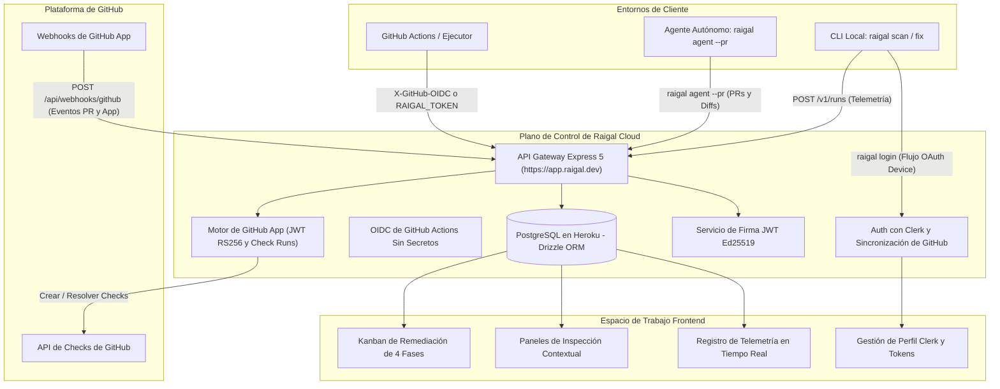

# Arquitectura de Raigal Cloud

Raigal Cloud es el plano de control centralizado de calidad para administrar organizaciones, analizar puertas de enlace en CI/CD, supervisar PRs de agentes de código autónomos, aplicar verificaciones nativas en GitHub Apps y expedir licencias de uso sin conexión.

## Topología de Alto Nivel

## Componentes Principales de Infraestructura

### 1. Aplicación Web y API Gateway
- **Backend Framework:** Express 5 ejecutándose sobre Node.js 22 LTS.
- **Frontend Dashboard:** React 19 + TypeScript + Vite + Tailwind CSS + Lucide icons.
- **Entorno de Ejecución:** Ecosistema dyno de Heroku con HTTPS automático en `https://app.raigal.dev`.

### 2. Identidad, Autenticación y Permisos
- **Proveedor de Identidad:** Clerk (`@clerk/express` y `@clerk/clerk-react`) con cambio multiorganización.
- **Sincronización Automática con GitHub:** Consulta y mapea automáticamente las cuentas verificadas y organizaciones de GitHub en la lista de permitidos.
- **Autorización OAuth Device Flow:** Facilita la autenticación desde la terminal (`raigal login` / `npx @methiu/raigal login`) mediante el flujo RFC 8628 para vincular equipos de desarrollo locales con organizaciones en la nube.
- **OIDC de GitHub Actions Sin Secretos:** Intercambia tokens OIDC de ejecutores de GitHub (`X-GitHub-OIDC`) por licencias efímeras, eliminando secretos estáticos en CI.

### 3. Motor Híbrido de GitHub App
- **Procesamiento de Webhooks:** Valida criptográficamente firmas HMAC-SHA256 capturando el cuerpo en bruto (`rawBody`).
- **Eventos del Ciclo de Vida:** Procesa `installation`, `installation_repositories` y `pull_request` (opened, synchronize, closed, reopened).
- **Gestión de Check Runs:** Genera JWTs de la App en RS256 con `jose`, los intercambia por tokens de instalación y gestiona checks nativos `"Raigal Quality Gate"` correlacionados por el commit `head_sha`.
- **Resolución Fail-Open:** La ingesta de ejecuciones de CI en `POST /v1/runs` resuelve los check runs de forma asíncrona; cualquier demora en la API de GitHub nunca bloquea la ingesta de métricas.
- **Limpieza de Verificaciones Huérfanas:** Limpia periódicamente verificaciones en estado pendiente con más de 20 minutos de antigüedad marcándolas como `timed_out`.

### 4. Capa de Base de Datos y Esquema
- **Motor de Base de Datos:** Heroku PostgreSQL.
- **ORM y Migraciones:** Drizzle ORM y `drizzle-kit`.
- **Entidades Fundamentales:**
  - `organizations`: Perfiles de cuentas, estado de suscripción y periodos de prueba.
  - `allowed_owners`: Lista de organizaciones y cuentas personales de GitHub autorizadas para enviar telemetría.
  - `pull_requests`: Registro persistente de puertas de enlace de CI y remediaciones de agentes con clave única `(org_id, repo_id, pr_number)`.
  - `github_installations`: Instalaciones de la GitHub App vinculadas a organizaciones autorizadas.
  - `github_check_runs`: Verificaciones activas y resueltas indexadas por `head_sha` y `(status, created_at)`.
  - `runs`: Ingesta de análisis de CLI, códigos de salida, puntuaciones globales y métricas temporales.
  - `findings`: Violaciones diagnósticas granulares asociadas a ejecuciones, identificadores de reglas y líneas de código.
  - `api_keys`: Claves secretas protegidas con hash SHA-256 (`rgl_live_...`).

### 5. Garantía de Cero Datos Simulados
Cada vista y métrica del tablero de Raigal Cloud proviene de telemetría real:
- Los hallazgos, puntuaciones y puertas de enlace se extraen directamente de tablas vivas de la base de datos.
- Las entregas desordenadas de webhooks se previenen con sentencias SQL protegidas por marca temporal (`WHERE excluded.started_at >= pull_requests.started_at`).
- No se inyectan puntuaciones artificiales ni duraciones ficticias en la canalización.
