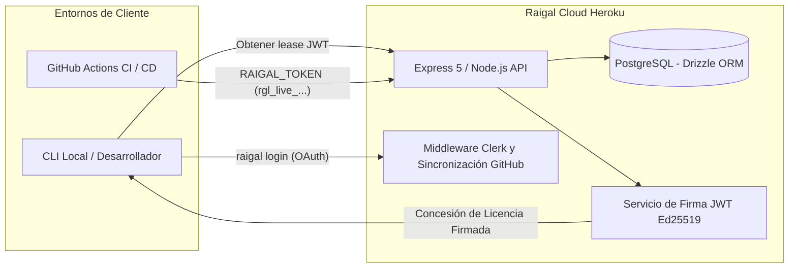

# Arquitectura de Raigal Cloud

Raigal Cloud es el plano de control central para la gestión de cuentas empresariales, membresías de equipos y emisión de concesiones fuera de línea.

## Topología de Alto Nivel

## Componentes Principales de Infraestructura

### 1. Aplicación Web y API
- **Framework**: Express 5 sobre Node.js 22.
- **Panel Web**: React 19 + Vite + Tailwind CSS + Lucide icons.
- **Alojamiento**: Entorno dyno de Heroku (proceso `web`).

### 2. Autenticación e Identidad
- **Proveedor**: Clerk (`@clerk/express` y `@clerk/clerk-react`).
- **Roles de Organización**: Sincronización automática de cuentas de GitHub y membresías en Clerk.

### 3. Capa de Datos
- **Motor**: Heroku PostgreSQL.
- **ORM**: Drizzle ORM con migraciones estructuradas mediante `drizzle-kit`.
- **Tablas**: `organizations`, `users`, `memberships`, `api_keys`, `leases`, `telemetry_events`.

### 4. Protección de Rutas de Administración
Las rutas de plataforma en `/api/admin/*` están protegidas estrictamente mediante la variable de entorno `PLATFORM_ADMIN_USER_IDS`. Cualquier llamada no autorizada recibe un código 404 para ocultar la existencia de la ruta.
