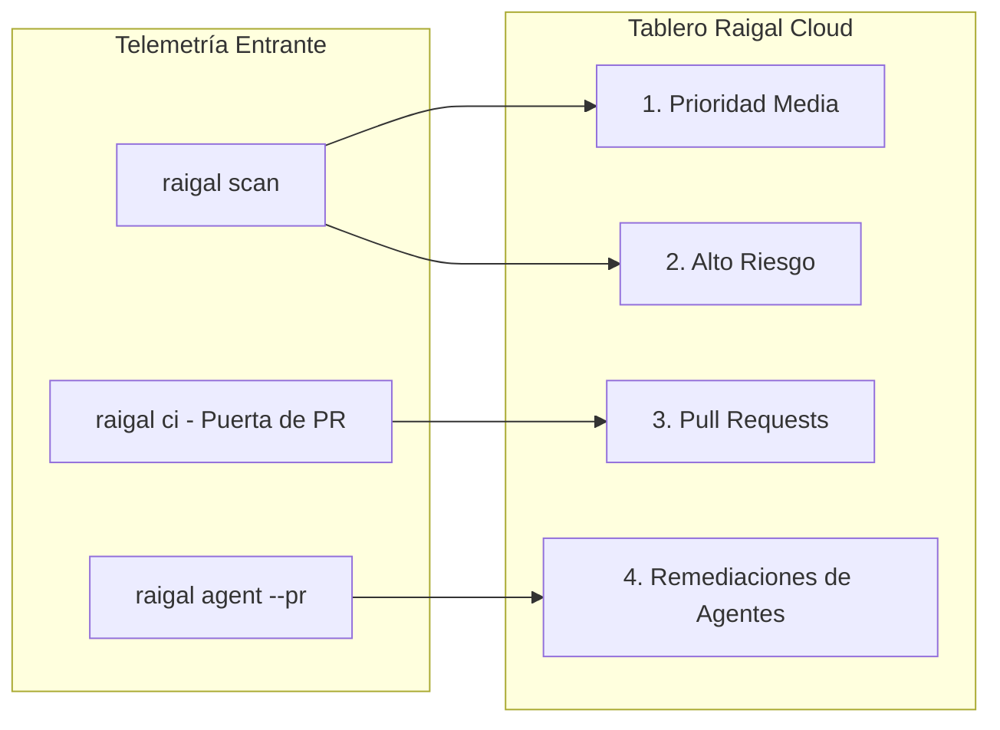

# Tablero Kanban y Telemetría

Raigal Cloud ofrece un tablero Kanban en tiempo real, ponderado por densidad de código, que transforma los hallazgos estáticos en flujos de trabajo accionables para desarrolladores y agentes.

## Las 4 Columnas del Tablero Kanban

El Tablero de Remediación organiza los hallazgos de cada repositorio en cuatro columnas especializadas:

### 1. Prioridad Media (Medium Priority)
- **Alcance:** Advertencias no bloqueantes, incoherencias de estilo, código muerto secundario y patrones leves de AI slop (comentarios obvios, comprobaciones de nulidad redundantes).
- **Acciones:** Copia en 1 clic del comando de corrección determinista (`npx @methiu/raigal fix --rule <rule-id>`).
- **Inspección:** Al pulsar sobre una tarjeta se despliega el panel lateral de inspección con la línea y fragmento exacto de código.

### 2. Alto Riesgo (High Risk)
- **Alcance:** Errores críticos que bloquean los gates de CI, secretos de API expuestos, inyecciones SQL/comandos, evasiones de tipado (`as any`) y excepciones silenciadas (`silent-catch`).
- **Acciones:** Etiquetas destacadas de gravedad crítica con instrucciones precisas de solución.

### 3. Pull Requests (Puertas de CI)
- **Alcance:** Pull Requests activos evaluados en tiempo real por el Quality Gate de Raigal mediante GitHub Actions o webhooks de GitHub App.
- **Distintivos de Estado:**
  - `PASSED [score]`: El PR cumple o supera el umbral de calidad configurado (la puntuación se muestra al evaluarse).
  - `BLOCKED [score]`: El PR contiene vulnerabilidades críticas o está por debajo de la puntuación mínima.
  - `IN REVIEW / PENDING`: El PR está abierto esperando evaluación de CI (creado al instante por la GitHub App).
  - `MERGED`: El PR ha sido fusionado en la rama principal (actualizado automáticamente vía webhook de GitHub App).
  - `CLOSED`: El PR fue cerrado sin fusionar.
- **Idempotencia y Aislamiento:** Múltiples pushes sobre el mismo PR actualizan la tarjeta in-place. Se filtran entregas fuera de orden para que ejecuciones antiguas nunca sobreescriban datos recientes. Los PRs estándar y las remediaciones de agentes se segregan limpiamente.

### 4. Remediaciones de Agentes (`--pr`)
- **Alcance:** Pull requests generados de forma autónoma por agentes de programación (`raigal agent --provider <opencode|claude|codex> --pr`).
- **Telemetría:**
  - **Identificador de Proveedor:** Muestra el agente autor (`opencode`, `claude`, `codex` u orquestadores personalizados).
  - **Mejora de Puntuación:** Refleja la diferencia cuantitativa de calidad (ej. `72 → 88 (+16 pts)`).
  - **Diff de Parche:** Muestra los parches unificados creados y verificados en worktrees aislados.

---

## Paneles Laterales de Inspección Contextual (Drawers)

Cada tarjeta del tablero permite abrir un panel lateral detallado con herramientas integradas:

<table data-view="cards">
  <thead>
    <tr>
      <th>Panel</th>
      <th>Contenido</th>
      <th>Acción Principal</th>
    </tr>
  </thead>
  <tbody>
    <tr>
      <td><strong>Panel de Vulnerabilidad</strong></td>
      <td>Identificador de regla, motor, número de línea, ruta y explicación.</td>
      <td><code>Copy CLI Fix</code> — Copia al portapapeles el comando de corrección.</td>
    </tr>
    <tr>
      <td><strong>Panel de Pull Request</strong></td>
      <td>Nombre de rama, autor, puntuación, registros de CI y fallos bloqueantes.</td>
      <td><code>Copy git checkout</code> — Copia el comando para inspeccionar la rama.</td>
    </tr>
    <tr>
      <td><strong>Panel de Agente</strong></td>
      <td>Proveedor de IA, comparativa antes/después y diff completo del parche.</td>
      <td><code>Copy gh merge</code> — Copia el comando de fusión inmediata en GitHub.</td>
    </tr>
  </tbody>
</table>

---

## Aislamiento por Rama y Cero Fuga de Estado

Para garantizar que los hallazgos no se mezclen entre ramas:
- El tablero consulta únicamente la **última ejecución completada** en la rama activa seleccionada.
- Cambiar de rama mediante el desplegable superior recalcula de inmediato los hallazgos y métricas sin arrastrar datos obsoletos.
- Las URLs con enlaces directos preservan el contexto completo: `/repos/:repoId?branch=feat/auth&drawer=vuln&id=...`.

---

## Navegación y Acciones Rápidas (⌘K)

- **Barra Superior:** Selector interactivo de repositorios en el encabezado sticky, selector de rama activa y accesos rápidos.
- **Paleta de Comandos (`⌘ K`):** Búsqueda instantánea para copiar comandos de escaneo o fix, acceder a la documentación oficial, filtrar por motor (AI Slop o Seguridad) o sincronizar repositorios de GitHub.
- **Panel de Configuración (Settings):** Consulta de `RAIGAL_API_URL`, gestión de tokens `RAIGAL_TOKEN` enmascarados, propietarios de GitHub autorizados e inspección de ejecuciones.
