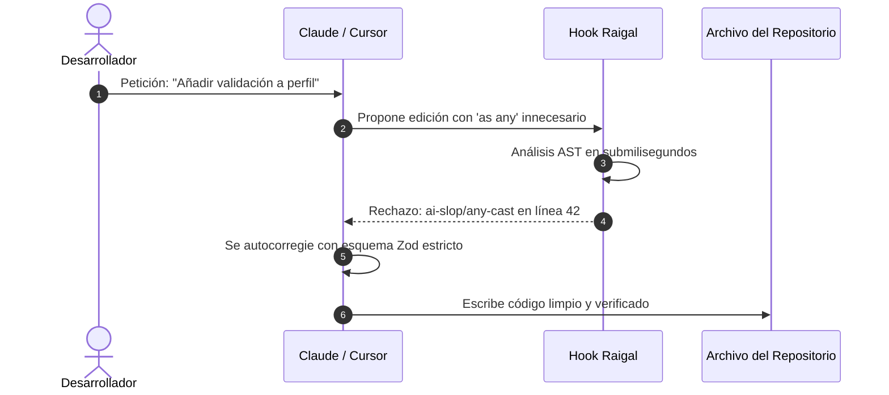

# Hooks en Tiempo Real para Agentes

Una de las capacidades diferenciales de Raigal es la intercepción en vivo: evaluar las ediciones propuestas por agentes de IA **antes** de que toquen el sistema de archivos.

## Funcionamiento de los Hooks

Cuando un agente de IA intenta modificar un archivo de código:
1. El hook ejecuta un análisis AST localizado en milisegundos sobre el búfer modificado.
2. Si el agente introduce AI slop (ej: comprobaciones de nulos redundantes, funciones auxiliares innecesarias o eliminación de control de errores), el hook rechaza o alerta de inmediato.
3. El agente recibe el diagnóstico exacto en su bucle de razonamiento y corrige el fallo automáticamente.



## Instalación de Hooks

Instale los hooks para todas las herramientas detectadas en el sistema:

```bash
raigal hook install
```

O configure herramientas específicas:

```bash
raigal hook install claude cursor opencode
```

## Estado y Línea Base

Compruebe el estado de los hooks:

```bash
raigal hook status
```

Guarde la puntuación actual del repositorio como línea base:

```bash
raigal hook baseline
```
El hook impedirá que futuras modificaciones de agentes rebajen dicha puntuación de referencia.
